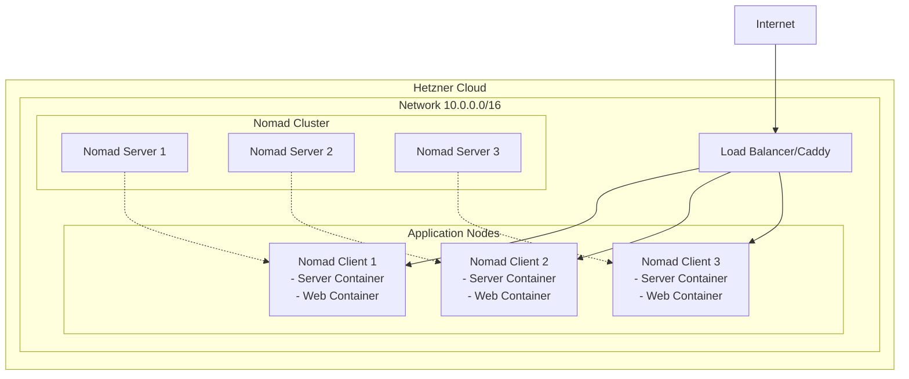
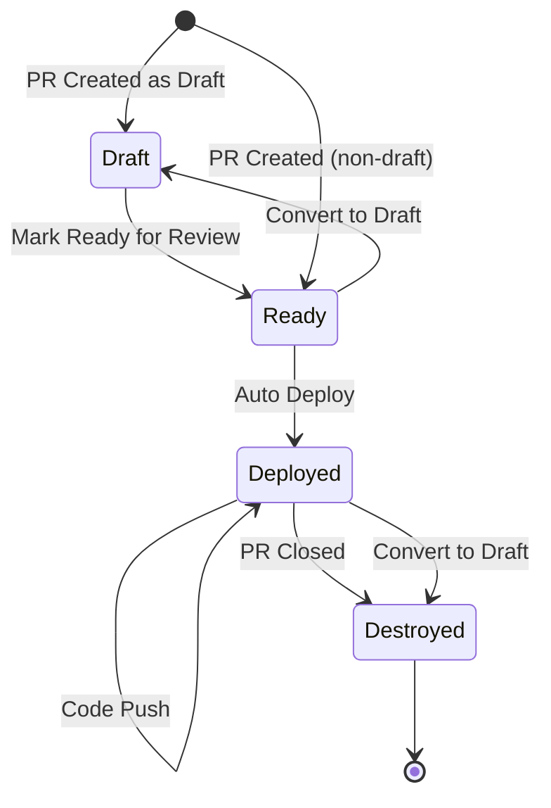

# Infrastructure

Complete infrastructure documentation for deploying Aipacto to Hetzner Cloud with Terraform, Nomad, and automatic PR environments.

## 📋 Table of Contents

- [Quick Start](#-quick-start)
- [Architecture Overview](#-architecture-overview)
- [Environment Types](#-environment-types)
- [Deployment Guide](#-deployment-guide)
- [PR Environments](#-pr-environments)
- [Cost Management](#-cost-management)
- [Troubleshooting](#-troubleshooting)
- [Security](#-security)
- [Monitoring](#-monitoring)
- [API Reference](#-api-reference)

## 🏃 Quick Start

```bash
# 1. Setup infrastructure directory
cd packages/infrastructure
chmod +x deploy.sh setup.sh
./setup.sh

# 2. Configure Hetzner API token
export HCLOUD_TOKEN="your-hetzner-cloud-api-token"

# 3. Deploy production
./deploy.sh production

# 4. Deploy PR environment
./deploy.sh pr 123
```

## 🏗️ Architecture Overview



### Tech Stack

- **Infrastructure**: Terraform v1.5+ with Hetzner Cloud Provider
- **Orchestration**: Nomad v1.9.2 + Consul v1.20.1
- **Containers**: Docker with optimized Alpine images
- **Reverse Proxy**: Caddy v2 (automatic HTTPS, serves static files)
- **CI/CD**: GitHub Actions (auto-deploy on push, PR environments)
- **Monitoring**: Prometheus + Grafana (optional)

### File Structure

```
packages/infrastructure/
├── deploy.sh                    # Main deployment script
├── terraform/
│   ├── modules/base/           # Reusable Terraform module
│   └── environments/
│       ├── production/         # Production config (3 servers, HA)
│       ├── staging/            # Staging config (1 server)
│       └── pr/                 # PR environment config (ephemeral)
├── nomad/
│   ├── jobs/                   # Nomad job definitions
│   └── configs/                # Caddy configurations
├── docker/
│   ├── server.Dockerfile       # Node.js API server
│   └── web.Dockerfile          # React app with Caddy
└── .github/workflows/
    ├── deploy-production.yml   # Auto-deploy main branch
    └── deploy-pr.yml           # PR environment automation
```

## 🌍 Environment Types

### Production

- **URL**: `https://aipacto.com`
- **Servers**: 3× cx22 (2 vCPU, 4GB RAM each)
- **High Availability**: Yes (3 Nomad servers)
- **Auto-deploy**: On push to `main`
- **Cost**: €13.77/month (3 × €4.59)

### Staging (Optional)

- **URL**: `https://staging.aipacto.com`
- **Servers**: 1× cx22 (2 vCPU, 4GB RAM)
- **High Availability**: No
- **Auto-deploy**: On push to `staging`
- **Cost**: €4.59/month

### PR Environments

- **URL**: `http://pr-{number}.pr.aipacto.com`
- **Servers**: 1× cx22 (2 vCPU, 4GB RAM)
- **Lifecycle**: Created on PR open, destroyed on close
- **Restrictions**: Only non-draft PRs
- **Max concurrent**: 15 environments
- **Cost**: €4.59/month per PR

## 📦 Deployment Guide

### Prerequisites

1. **Hetzner Cloud Account**
   - Create at: <https://console.hetzner.cloud>
   - Generate API token: Project → Security → API Tokens
   - Add SSH key: Project → Security → SSH Keys

2. **GitHub Repository Setup**

   ```yaml
   # Required Secrets (Settings → Secrets → Actions)
   HCLOUD_TOKEN: "hcloud-api-token"
   SSH_KEY_NAME: "ssh-key-name"
   AWS_ACCESS_KEY_ID: "terraform-state"
   AWS_SECRET_ACCESS_KEY: "terraform-state"
   
   # Required Variables (Settings → Variables → Actions)
   PRODUCTION_DOMAIN: "aipacto.com"
   MAX_PR_ENVIRONMENTS: "15"
   ```

3. **Local Tools** (for manual deployment)

   ```bash
   # macOS
   brew install terraform docker hcloud
   
   # Or use Nix
   nix develop
   ```

### Production Deployment

```bash
# 1. Configure environment
cd packages/infrastructure
cp terraform/environments/production/terraform.tfvars.example \
   terraform/environments/production/terraform.tfvars
# Edit terraform.tfvars with your values

# 2. Deploy infrastructure
export HCLOUD_TOKEN="your-token"
./deploy.sh production

# 3. Verify deployment
curl https://aipacto.com/health
```

### Manual Terraform Commands

```bash
# Initialize
cd terraform/environments/production
terraform init

# Plan changes
terraform plan -out=tfplan

# Apply changes
terraform apply tfplan

# Destroy (WARNING!)
terraform destroy
```

### Docker Image Building

```bash
# Build images
docker build -f docker/server.Dockerfile -t developeraipacto/aipacto-server:latest ../..
docker build -f docker/web.Dockerfile -t developeraipacto/aipacto-web:latest ../..

# Push to registry
docker push developeraipacto/aipacto-server:latest
docker push developeraipacto/aipacto-web:latest
```

## 🔄 PR Environments

### How It Works

1. **Developer opens PR** (non-draft) → Environment deploys automatically
2. **PR converted to draft** → Environment destroyed
3. **PR closed/merged** → Environment destroyed immediately
4. **Comment `/deploy`** → Manual deployment trigger

### PR Commands

In any PR comment:

- `/deploy` - Deploy PR environment (non-draft PRs only)
- `/redeploy` - Force redeploy
- `/destroy` - Manually destroy environment

### PR Environment Lifecycle



### Limitations

- **Max 15 concurrent PR environments** (prevents cost overrun)
- **Only non-draft PRs** get environments
- **No auto-cleanup needed** (destroyed on PR close)

## 💰 Cost Management

### Monthly Costs

| Environment | Servers | Config | Monthly | Annual |
|------------|---------|--------|---------|--------|
| Production | 3 | cx22 (2CPU, 4GB) | €13.77 | €165.24 |
| Staging | 1 | cx22 (2CPU, 4GB) | €4.59 | €55.08 |
| PR (each) | 1 | cx22 (2CPU, 4GB) | €4.59 | - |
| **Typical Total** | | 5-8 PRs | €36-45 | €432-540 |
| **Maximum Total** | | 15 PRs | €82.62 | €991.44 |

### Cost Optimization Tips

1. **Use draft PRs** during development (no environment)
2. **Close PRs promptly** when done
3. **Share staging** for integration testing
4. **Monitor usage**: `hcloud server list --selector project=aipacto`

### Server Types & Pricing

| Type | vCPU | RAM | Storage | Price/mo |
|------|------|-----|---------|----------|
| cx22 | 2 | 4GB | 40GB | €4.59 |
| cx32 | 4 | 8GB | 80GB | €11.55 |
| cx42 | 8 | 16GB | 160GB | €23.10 |
| cx52 | 16 | 32GB | 320GB | €46.20 |

## 🔧 Troubleshooting

### Common Issues

#### PR Environment Not Deploying

```bash
# Check if PR is draft
gh pr view 123 --json isDraft

# Check current PR count
hcloud server list --selector environment~pr-

# Manual deploy
./deploy.sh pr 123
```

#### Nomad Jobs Failing

```bash
# SSH into server
ssh root@$(terraform output -raw nomad_server_ips | jq -r '.[0]')

# Check Nomad status
nomad job status aipacto-server
nomad alloc status <alloc-id>
nomad alloc logs <alloc-id>

# Check Consul
consul members
consul catalog services
```

#### Container Issues

```bash
# Check Docker images
docker images | grep aipacto

# Check container logs
docker logs <container-id>

# Health check
curl http://server-ip:3000/health
```

### Debug Commands

```bash
# List all infrastructure
hcloud server list --selector project=aipacto

# Check Terraform state
cd terraform/environments/production
terraform show

# View Nomad UI
open http://$(terraform output -raw nomad_ui_url)

# Check logs
journalctl -u nomad -f
journalctl -u consul -f
journalctl -u docker -f
```

## 🔒 Security

### Access Control

Tailscale is used for internal communication and VPN access.

### Secrets Management

```bash
# Store in Consul KV
consul kv put aipacto/production/db_password "secret"
consul kv put aipacto/production/jwt_secret "secret"

# Or use environment variables
export DATABASE_URL="postgresql://..."
export JWT_SECRET="..."
```

### Security Checklist

- [ ] Restrict SSH access to specific IPs
- [ ] Restrict Nomad/Consul UI access
- [ ] Use strong API tokens
- [ ] Enable Nomad ACLs in production
- [ ] Rotate secrets regularly
- [ ] Enable audit logging
- [ ] Use private network for internal communication
- [ ] Regular security updates: `apt update && apt upgrade`

## 📊 Monitoring

### Health Endpoints

```bash
# Application health
curl https://aipacto.com/health

# API health
curl https://aipacto.com/api/health

# Nomad health
curl http://nomad-server:4646/v1/agent/health

# Consul health
curl http://consul-server:8500/v1/agent/checks
```

### Metrics Available

- Request rate & latency
- Error rates (4xx, 5xx)
- CPU & memory usage
- Active users
- Database connections
- Container health

## 📚 API Reference

### Deployment Script

```bash
./deploy.sh <command> [options]

Commands:
  production    Deploy production environment
  staging       Deploy staging environment  
  pr <number>   Deploy PR environment
  destroy <env> [number]  Destroy environment
  list          List all environments

Examples:
  ./deploy.sh production
  ./deploy.sh pr 123
  ./deploy.sh destroy pr 123
```

### Terraform Outputs

```bash
# Get infrastructure details
cd terraform/environments/production

terraform output load_balancer_ip    # Public IP
terraform output nomad_ui_url        # Nomad dashboard
terraform output consul_ui_url       # Consul dashboard
terraform output environment_url     # Application URL
```

### Makefile Commands

```bash
make help                 # Show all commands
make deploy-production    # Deploy production
make deploy-pr PR=123     # Deploy PR
make docker-build        # Build Docker images
make nomad-status        # Check Nomad cluster
make cost                # Show cost estimate
```

## 🆘 Support & Resources

### Documentation

- [Hetzner Cloud Docs](https://docs.hetzner.com/cloud/)
- [Terraform Registry](https://registry.terraform.io/providers/hetznercloud/hcloud)
- [Nomad Docs](https://www.nomadproject.io/docs)
- [Consul Docs](https://www.consul.io/docs)
- [Caddy Docs](https://caddyserver.com/docs)

### Troubleshooting Resources

- Hetzner Status: <https://status.hetzner.com>
- GitHub Actions: Check `.github/workflows/` for CI/CD
- Logs: SSH to servers and check `/var/log/`

## Quick Reference for AI Assistants

### Key Information

- **Infrastructure as Code**: Terraform with Hetzner provider
- **Container Orchestration**: Nomad + Consul
- **Reverse Proxy**: Caddy (automatic HTTPS)
- **PR Environments**: Automatic, non-draft only, destroyed on close
- **Max PR Environments**: 15 concurrent
- **Production Servers**: 3× cx22 (HA setup)
- **Monthly Cost**: €13.77 (prod) + €4.59 per PR

### Common Tasks

```bash
# Deploy production
HCLOUD_TOKEN=xxx ./deploy.sh production

# Deploy PR
HCLOUD_TOKEN=xxx ./deploy.sh pr 123

# Check status
hcloud server list --selector project=aipacto

# View logs
ssh root@server-ip journalctl -u nomad -f

# Destroy PR
./deploy.sh destroy pr 123
```

### File Locations

- Main script: `deploy.sh`
- Terraform: `terraform/environments/*/main.tf`
- Docker: `docker/*.Dockerfile`
- Nomad jobs: `nomad/jobs/*.nomad`
- GitHub Actions: `.github/workflows/*.yml`
